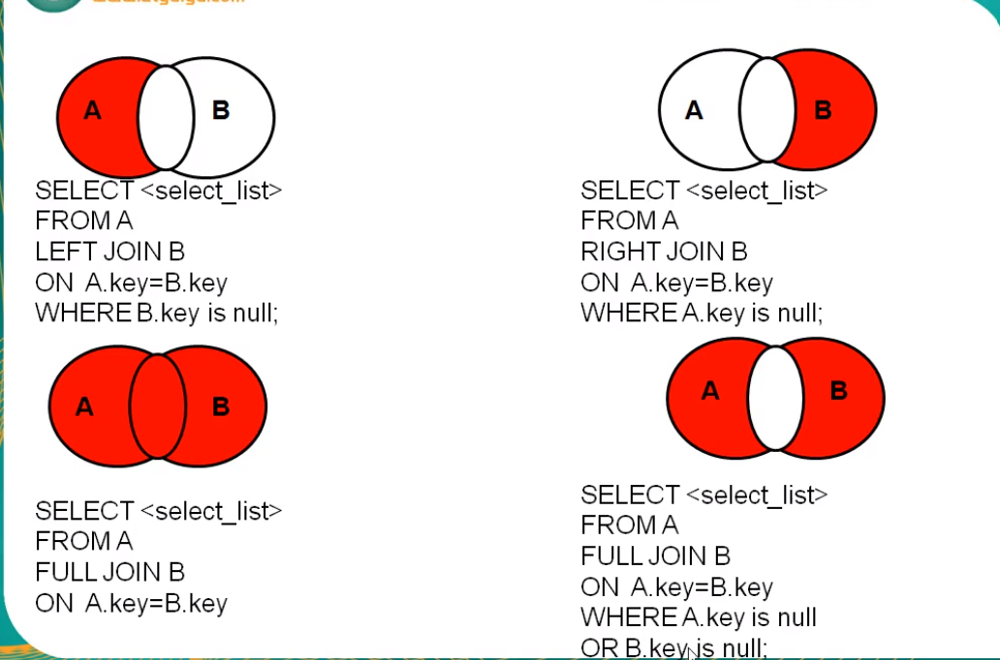

# 参考

# 简介
笛卡尔乘积现象 ：表1 有m行 ，表2 n行 结果m*n 行 
发生原因: 没有有效的连接条件
举例： select * from 表1 表2

语法：
	select 查询列表
	from 表1 别名 【连接类型】
	join 表2 别名 
	on 连接条件
	【where 筛选条件】
	【group by 分组】
	【having 筛选条件】
	【order by 排序列表】
	

分类：
内连接（★）：inner
外连接
	左外(★):left 【outer】
	右外(★)：right 【outer】
	全外：full【outer】
交叉连接：cross 

# 详解

[1] 内连接

语法：

select 查询列表
from 表1 别名
inner join 表2 别名
on 连接条件;

分类：
等值
非等值
自连接

特点：
①添加排序、分组、筛选
②inner可以省略
③ 筛选条件放在where后面，连接条件放在on后面，提高分离性，便于阅读
④inner join连接和sql92语法中的等值连接效果是一样的，都是查询多表的交集

查询部门个数>3的城市名和部门个数，（添加分组+筛选）

#①查询每个城市的部门个数
#②在①结果上筛选满足条件的
SELECT city,COUNT(*) 部门个数
FROM departments d
INNER JOIN locations l
ON d.`location_id`=l.`location_id`
GROUP BY city
HAVING COUNT(*)>3;

[2] 外连接
应用场景：用于查询一个表中有，另一个表没有的记录
 
 特点：
 1、外连接的查询结果为主表中的所有记录
	如果从表中有和它匹配的，则显示匹配的值
	如果从表中没有和它匹配的，则显示null
	外连接查询结果=内连接结果+主表中有而从表没有的记录
 2、左外连接，left join左边的是主表
    右外连接，right join右边的是主表
 3、左外和右外交换两个表的顺序，可以实现同样的效果 
 4、全外连接=内连接的结果+表1中有但表2没有的+表2中有但表1没有的

 #全外
 USE girls;
 SELECT b.*,bo.*
 FROM beauty b
 FULL OUTER JOIN boys bo
 ON b.`boyfriend_id` = bo.id;
 
 #交叉连接 （相当于 笛卡尔积 ）
 SELECT b.*,bo.*
 FROM beauty b
 CROSS JOIN boys bo;
等同于
 SELECT b.*,bo.*
 FROM beauty b  boys bo;

# 外连接的特殊情况

